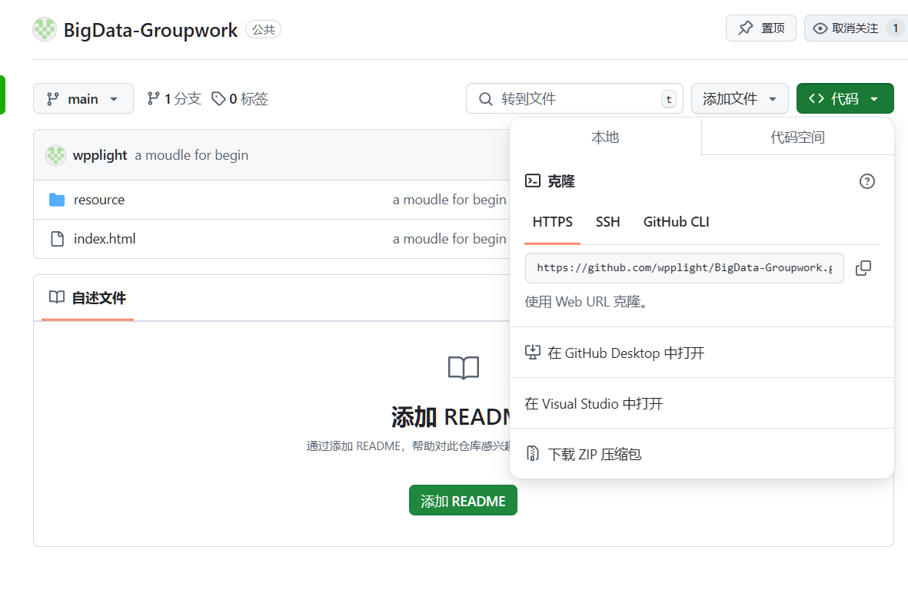
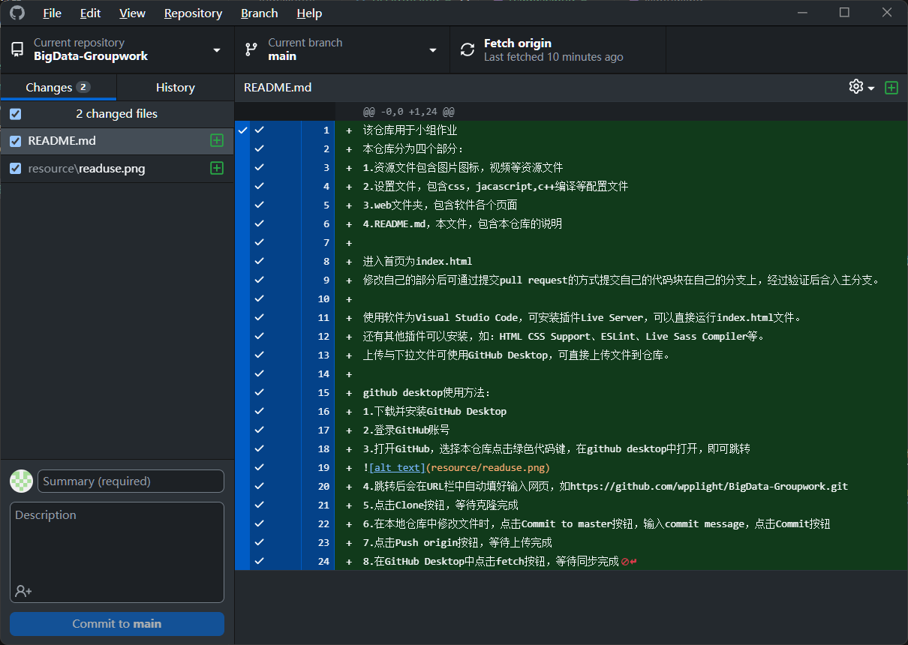

项目名称：牛魔要吃饭

该仓库用于小组作业

本仓库分为四个部分：

1.资源文件包含图片图标，视频等资源文件

2.设置文件，包含css，jacascript,c++编译等配置文件

3.web文件夹，包含软件各个页面

4.README.md，本文件，包含本仓库的说明

进入首页为index.html
修改自己的部分后可通过提交pull request的方式提交自己的代码块在自己的分支上，经过验证后合入主分支。

使用软件为Visual Studio Code，可安装插件Live Server，可以直接运行index.html文件。
还有其他插件可以安装，如：HTML CSS Support、ESLint、Live Sass Compiler等。
上传与下拉文件可使用GitHub Desktop，可直接上传文件到仓库。

github desktop使用方法：

1.下载并安装GitHub Desktop

2.登录GitHub账号

3.打开GitHub，选择本仓库点击绿色代码键，在github desktop中打开，即可跳转

4.跳转后会在URL栏中自动填好输入网页，如https://github.com/wpplight/BigData-Groupwork.git

5.点击Clone按钮，等待克隆完成

6.在本地仓库中修改文件时，点击Commit to master按钮，输入commit message，点击Commit按钮

7.点击Push origin按钮，等待上传完成

8.在GitHub Desktop中点击fetch按钮，等待同步完成

